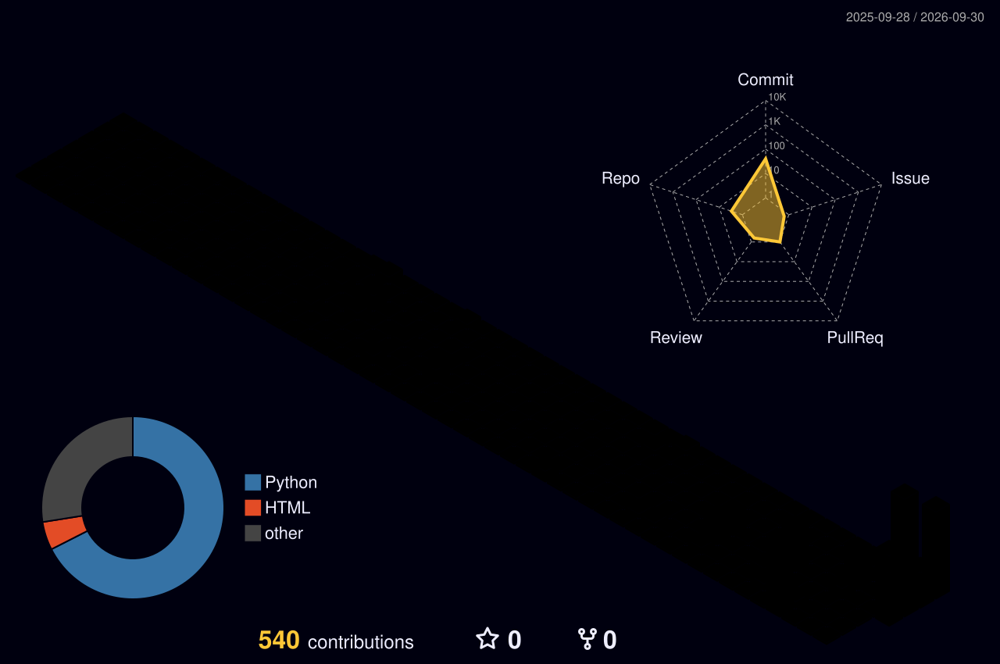

<!--
Repositório de perfil: https://github.com/Josue04Santos/Josue04Santos
Informações principais sempre visíveis. Seções técnicas longas ficam recolhíveis.
-->

# 👋 Josué Santos

### Desenvolvedor de Software · Python · Automação · Dados

 

---

## 🚀 Resumo

Sou **entusiasta de tecnologia e desenvolvedor de software**, estudante de **Análise e Desenvolvimento de Sistemas**, transformando ideias em código. Meu foco está em **Python, automação de processos e análise de dados**, além de aplicações web com **TypeScript e Node.js**.

Desenvolvo sistemas internos, bots de integração, automações para ERP, controle financeiro e aplicações de mapas, sempre buscando soluções práticas que economizem tempo e reduzam trabalho manual.

## 🏗️ Portfólio

<b>🧩 Áreas de atuação</b>

 

<table>
<tr>
<td width="50%" valign="top">

### 🐍 Python & Automação

- Scripts e rotinas automatizadas
- Integração com ERP (TOTVS)
- Bots para Telegram
- Integração entre sistemas e APIs
- Alertas e agendamentos

</td>
<td width="50%" valign="top">

### 📊 Análise de Dados

- Coleta e tratamento de dados
- Calendário econômico automatizado
- Relatórios e indicadores
- Controle financeiro e de despesas

</td>
</tr>
<tr>
<td width="50%" valign="top">

### 🌐 Aplicações Web

- TypeScript · Node.js
- Aplicações internas e painéis
- Fluxo de caixa e compras de TI
- Aplicações com mapas

</td>
<td width="50%" valign="top">

### 🛠️ Suporte & Infraestrutura

- Acesso remoto (RustDesk)
- Mídia self-hosted (Jellyfin)
- Git e versionamento
- Documentação técnica

</td>
</tr>
</table>

<b>🐍 Animação do mapa de contribuições</b>

 

<picture>
<source media="(prefers-color-scheme: dark)" srcset="https://raw.githubusercontent.com/Josue04Santos/Josue04Santos/output/snake-dark.svg">
<source media="(prefers-color-scheme: light)" srcset="https://raw.githubusercontent.com/Josue04Santos/Josue04Santos/output/snake.svg">

</picture>

<b>🎯 Foco atual</b>

 

- Evoluindo em **Python** para automação, integrações e análise de dados.
- Construindo aplicações **TypeScript / Node.js** para gestão interna.
- Criando **bots e integrações** que conectam sistemas e equipes.
- Estudando boas práticas de arquitetura, versionamento e documentação.

<b>📁 Repositórios privados e projetos internos</b>

 

`campus_agentes` · `auto-totvs` · `app_dplmaps` · `app_programacao` · `compra_ti` · `app_fluxocaixa` · `fluxosul` · `DPL-Telegram` · `rustdesk-dpl` · `parse`

Estes repositórios são privados por conterem estruturas internas ou dados operacionais. As tecnologias e resultados estão representados aqui sem expor informações confidenciais.

## 🧰 Stack de tecnologias

> Clique em um badge para abrir a documentação oficial.

<b>💻 Linguagens</b>

 

<b>🤖 Automação, integrações & ferramentas</b>

 

<b>🧪 Projetos em destaque</b>

 

<table>
<tr>
<td width="50%" valign="top">

### 📅 [Calendário Econômico](https://github.com/Josue04Santos/calendario-economico)

Calendário econômico automatizado com alertas e integração Python.

`Python` `Automação` `Economia` `Alertas`

</td>
<td width="50%" valign="top">

### 🔗 [Bot Integrador](https://github.com/Josue04Santos/bot-integrador)

Bot de integração entre sistemas, automatizando o fluxo de informações.

`Python` `Bot` `Integração`

</td>
</tr>
<tr>
<td width="50%" valign="top">

### 🏅 [Certificados 5S](https://github.com/Josue04Santos/certificados-5s)

Página para geração e exibição de certificados do programa 5S.

`HTML` `Web`

</td>
<td width="50%" valign="top">

### 🎬 [Jellyfin.org (fork)](https://github.com/Josue04Santos/jellyfin.org)

Contribuição e estudo do site e documentação do projeto Jellyfin.

`MDX` `Open Source` `Documentação`

</td>
</tr>
</table>

## 📊 Atividade no GitHub

<b>🏙️ Calendário de contribuições 3D</b>

 

## 🤝 Parceiros

> **[José Carlos Santos Costa](https://github.com/CarlosSuporteISP)** — Senior Network & Infrastructure Engineer, com 12+ anos em ISPs (BGP, MPLS, IPv6, Linux, Docker, Proxmox).
>
> 
> 
> 

## 📬 Vamos conversar

Estou aberto a **oportunidades remotas, híbridas e presenciais**, projetos freelance e colaborações em:

- Desenvolvimento de Software
- Automação com Python
- Análise de Dados
- Integrações e Bots
- Aplicações Web (TypeScript / Node.js)

  

_Transformando ideias em código._

